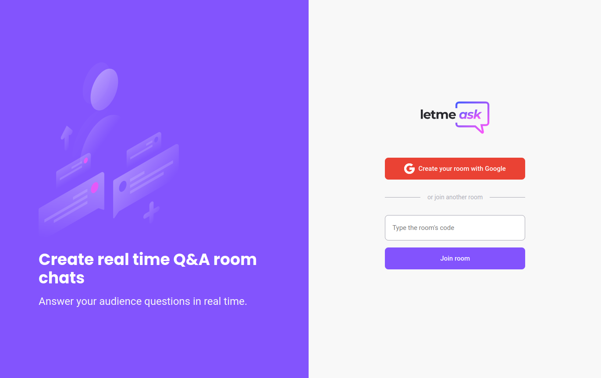

# Let Me Ask

- Let Me Ask is perfect for content creators create Q&A rooms for their public. 
- Admins can mark questions as answered, highlighted and delete questions.
- Users can create and like questions.
- Login with Google authentication.
- To join rooms users need the rooms code, which can be clippboarded by the room admin.

[Let Me Ask](https://let-me-ask-f210b.firebaseapp.com/)

## 💻 Project

This project was bootstrapped with [Create React App](https://github.com/facebook/create-react-app).

This project was developed in the Next Level Week, free program designed by [@RocketSeat](https://github.com/rocketseat-education) to help developers learn by bulding projects.

## 🧪 Built With

- React
- TypeScript
- Firebase

## 🚀 Run This Project In Your Local Machine:

### You need:

- `yarn`
- `nodejs`
- `npm`

### Steps:

Clone this repo in your local machine with:

- `git clone git@github.com:thneves/Let-Me-Ask.git`

In the project directory, you can run:

- `yarn start`

Runs the app in the development mode.\
Open [http://localhost:3000](http://localhost:3000) to view it in the browser.

## Author

👤 **Thales Neves**

- GitHub: [@thneves](https://github.com/thneves)
- Twitter: [@tsneves11](https://twitter.com/tsneves11)
- LinkedIn: [Thales Neves](https://www.linkedin.com/in/thales-neves10/)

## 🤝 Contributing

Contributions, issues, and feature requests are welcome!

Feel free to check the [issues page]((https://github.com/thneves/City-Weather/issues)).

## 🔖 Show your support

Give a ⭐️ if you like this project!

## 📝 Acknowlegements

- The idea of this app was developed by [@rocketseat](https://github.com/rocketseat-education)
- Instructor [@Diego Fernandes](https://github.com/diego3g)
- Layout Web [Figma](https://www.figma.com/file/5EwwWfALSlOn5o4LpwzB6l/Letmeask-Copy?fuid=869742879062948552)
